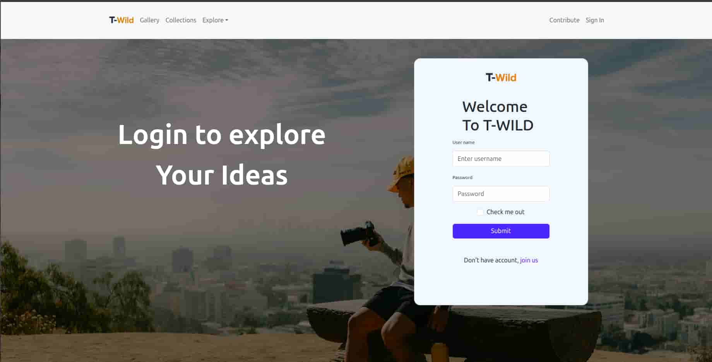
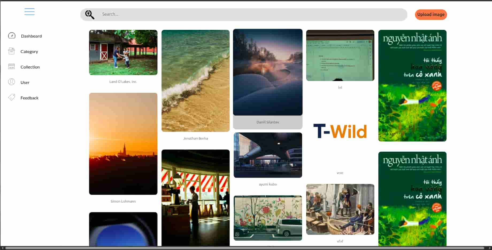
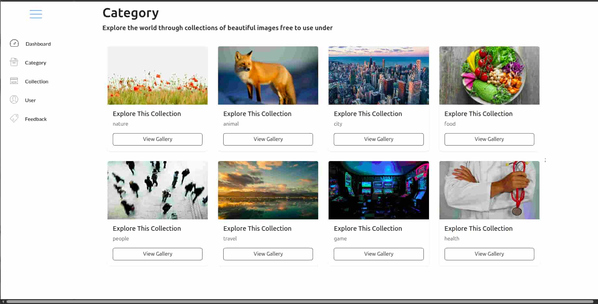
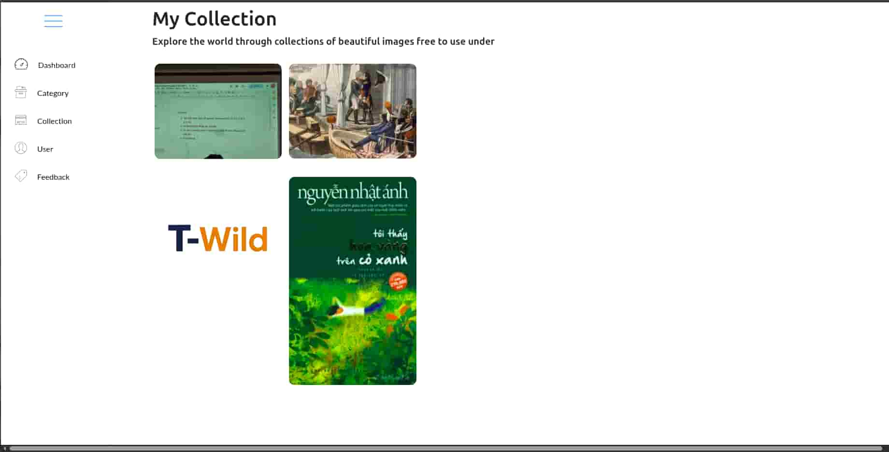
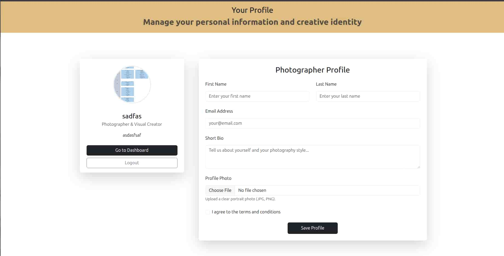
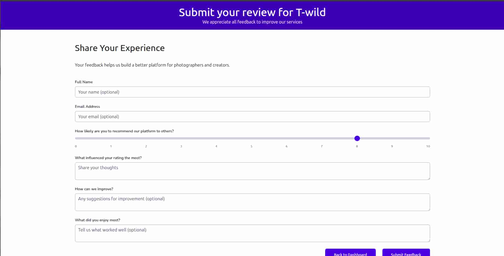

# 📸 T-Wild – Image Sharing Platform (Pinterest-Lite)

T-Wild là nền tảng chia sẻ và khám phá hình ảnh hiện đại cho phép người dùng tải lên, quản lý và tổ chức các bộ sưu tập ảnh sáng tạo. Ứng dụng được xây dựng theo kiến trúc **Full-Stack Web Application** sử dụng Spring Boot cho backend và React + Vite cho frontend.
Link:[🚀 Live Demo](https://twild-gallery.vercel.app)


---

## 🚀 Features

### 👤 Authentication & User Management
- Đăng ký / Đăng nhập tài khoản
- JWT Authentication & Authorization
- Quản lý hồ sơ người dùng
- Upload & cập nhật ảnh đại diện
- Logout & bảo mật session

---

### 🖼️ Image Management
- Upload ảnh lên Cloudinary
- Lưu metadata ảnh
- Hiển thị gallery dạng Masonry / Grid layout
- Tìm kiếm ảnh theo từ khóa
- Hiển thị thông tin tác giả ảnh
- Xóa / quản lý ảnh cá nhân

---

### 📚 Collections & Categories
- Tạo và quản lý bộ sưu tập ảnh
- Phân loại ảnh theo Category:
  - Nature
  - Animal
  - City
  - Food
  - People
  - Travel
  - Game
  - Health
- Xem gallery theo danh mục


- Lưu ảnh vào bộ sưu tập cá nhân

---

### 🔍 Profile Management
- Quản lý profile cá nhân
- Hiển thị ảnh đã upload

---

### ⭐ Feedback & Rating
- Người dùng gửi đánh giá hệ thống
- Thang điểm NPS (0 → 10)
- Thu thập góp ý cải thiện dịch vụ

---

## 🛠️ Tech Stack

### Frontend
- React
- Vite
- Axios
- React Router
- Tailwind CSS / CSS

### Backend
- Spring Boot
- Spring Security
- JWT Authentication
- JPA / Hibernate

### External Services
- Cloudinary
- Unsplash API
## 🏗 System Architecture

```text
Frontend (React + Vite)
        │
        │ REST API
        ▼
Backend (Spring Boot)
        │
        ├── Database (User + Metadata)
        ├── Cloudinary (Image Storage)
        └── Unsplash API
```
## 📈 Future Improvements

- Like / Comment system
- Follow users
- AI image recommendation
- Real-time notification
- Admin moderation dashboard
